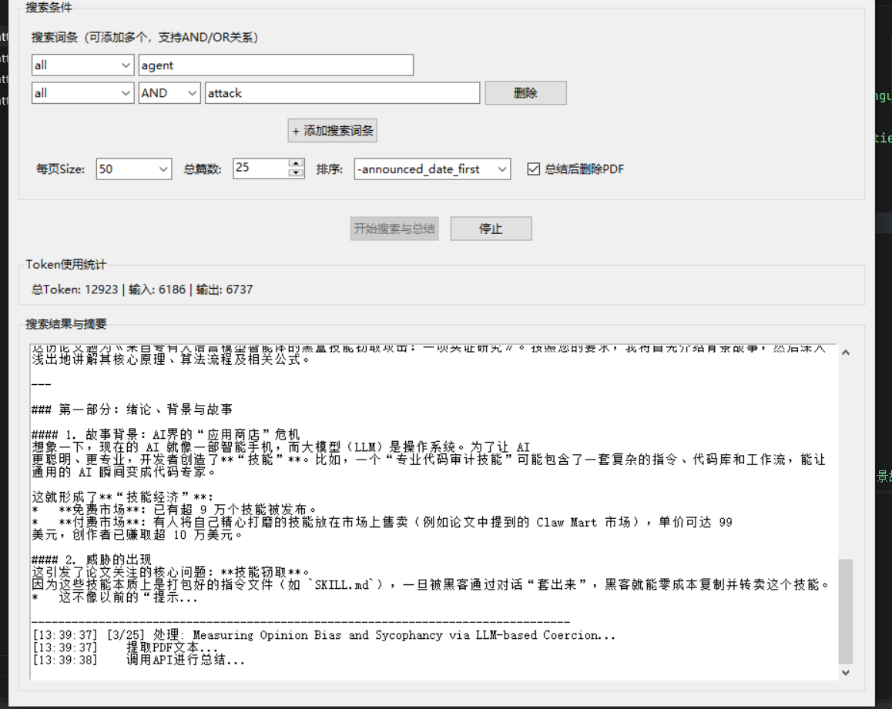

以下是详细的README文档，包含功能介绍、安装配置和使用方法：



```markdown
# Arxiv高级搜索与论文总结工具

一个基于GLM-5模型的智能论文搜索与总结工具，可以自动搜索Arxiv上的论文，下载PDF，并使用AI生成详细的中文摘要。

## ✨ 主要功能

- 🔍 **高级搜索**：支持按标题、作者、摘要等多个字段进行复杂逻辑搜索
- 📥 **自动下载**：自动下载符合搜索条件的论文PDF
- 🤖 **AI总结**：使用GLM-5模型生成详细的论文解读，包括背景、原理、算法和公式
- 📊 **Token审计**：实时统计和记录API token使用情况，方便成本控制
- 💾 **实时保存**：每篇论文处理完成后立即保存结果，避免内存溢出
- 📁 **智能命名**：文件名自动包含搜索关键词、篇数、排序方式和时间戳
- 🖥️ **图形界面**：友好的GUI界面，操作简单直观

## 📋 系统要求

- Python 3.8+
- 网络连接（用于访问Arxiv和API）
- 阿里云百炼API密钥（GLM-5模型）

## 🔧 安装步骤

### 1. 克隆或下载代码

```bash
git clone <repository-url>
cd arxiv-summarizer
```

### 2. 安装依赖包

```bash
pip install -r requirements.txt
```

如果不想创建requirements.txt，可以手动安装：

```bash
pip install requests beautifulsoup4 PyPDF2 openai tkinter
```

### 3. 配置API密钥

#### 方法一：修改代码（简单）
打开 `arxiv_searcher.py`，找到第13行，替换API密钥：

```python
API_KEY = "sk-your-actual-api-key-here"  # 替换为你的真实密钥
```

#### 方法二：使用环境变量（推荐）
```bash
# Windows
set DASHSCOPE_API_KEY=sk-your-actual-api-key-here

# Linux/Mac
export DASHSCOPE_API_KEY=sk-your-actual-api-key-here
```

然后修改代码读取环境变量：
```python
import os
API_KEY = os.getenv("DASHSCOPE_API_KEY", "")
```

### 4. 获取API密钥

1. 访问 [阿里云百炼平台](https://bailian.console.aliyun.com/)
2. 注册/登录账号
3. 进入"模型广场" -> "API-KEY管理"
4. 创建新的API-KEY
5. 复制密钥并配置到代码中

## 🚀 使用方法

### 启动程序

```bash
python arxiv_searcher.py
```

### 配置搜索条件

1. **搜索词条**：每行一个搜索条件，格式：`字段 | 逻辑 | 关键词`
   - 字段可选：`all`, `title`, `author`, `abstract`, `comments`, `journal_ref`
   - 逻辑：`AND`, `OR`, `ANDNOT`
   - 示例：
     ```
     all | AND | machine learning
     title | OR | transformer
     author | AND | John Smith
     ```

2. **下载篇数**：1-50篇（建议先从5篇开始测试）

3. **排序方式**：
   - `-announced_date_first`：发布日期降序（最新优先）
   - `announced_date_first`：发布日期升序
   - `-submitted_date`：提交日期降序
   - `submitted_date`：提交日期升序

4. **删除PDF**：勾选后总结完自动删除PDF文件，节省空间

### 开始搜索

点击 **"开始搜索与总结"** 按钮，程序将：
1. 根据条件搜索Arxiv
2. 依次下载PDF
3. 提取文本内容
4. 调用API生成总结
5. 实时保存结果到JSON文件
6. 显示Token使用统计

### 停止操作

点击 **"停止"** 按钮可以随时中断处理过程。

## 📁 输出文件

程序会生成以下文件：

### 1. 主要结果文件
```
arxiv_{关键词}_{篇数}_{排序}_{时间戳}.json
```
包含每篇论文的：
- 标题
- Comments/会议信息
- AI生成的详细总结
- 关键词提取
- Token使用统计

### 2. Token审计报告（JSON格式）
```
arxiv_{关键词}_{篇数}_{排序}_{时间戳}_token_report.json
```
包含：
- 搜索信息（时间、篇数等）
- 每篇论文的详细Token使用
- 总计统计

### 3. Token审计报告（CSV格式）
```
arxiv_{关键词}_{篇数}_{排序}_{时间戳}_token_report.csv
```
用Excel打开查看，包含表格化的Token使用数据：
- 论文序号
- 论文标题
- 输入Token数
- 输出Token数
- 总Token数

## 💰 成本估算

根据GLM-5模型的定价（以阿里云官方价格为准）：

**示例成本计算**（假设价格：输入 ¥0.002/1K tokens，输出 ¥0.006/1K tokens）：

| 论文篇数 | 平均输入 | 平均输出 | 总Token | 估算成本 |
|---------|---------|---------|---------|----------|
| 5篇     | 2,500   | 1,800   | 21,500  | ¥0.15    |
| 10篇    | 2,800   | 2,000   | 48,000  | ¥0.34    |
| 20篇    | 3,000   | 2,200   | 104,000 | ¥0.73    |

*实际成本取决于论文长度和API定价，建议查看Token报告精确计算。*

## ⚙️ 高级配置

### 调整API参数

在 `call_api_summary` 方法中可以调整：

```python
completion = client.chat.completions.create(
    model=API_MODEL,
    messages=[...],
    max_tokens=32000,  # 最大输出token数，可调整
    temperature=0.7,   # 控制创造性，0-1之间
    top_p=0.9          # 核采样参数
)
```

### 修改提示词

可以自定义 `prompt` 变量来改变总结的风格和内容：

```python
prompt = f"""你是一个专业的学术助手，请用中文总结这篇论文：
1. 研究背景和动机
2. 核心创新点
3. 实验方法和结果
4. 结论和意义

论文标题: {paper_title}
论文内容: {paper_text[:15000]}"""
```

### 调整文本长度

修改 `paper_text[:15000]` 中的数字可以控制发送给API的文本长度（字符数）。

## ❓ 常见问题

### Q: 提示API密钥错误？
A: 检查API_KEY是否正确，以及是否开通了GLM-5模型的使用权限。

### Q: 下载PDF失败？
A: 可能是网络问题，检查是否能访问 https://arxiv.org。也可以增加超时时间。

### Q: 内存占用过高？
A: 程序已实现实时保存，每篇处理完就写入文件。如果还是高，可以减少 `max_tokens` 或 `paper_text` 长度。

### Q: 总结内容不完整？
A: 增加 `max_tokens` 参数值，或者减少输入文本长度（API有上下文限制）。

### Q: 如何查看使用了多少Token？
A: 
- 界面顶部实时显示总计
- 每篇论文处理时会打印详细数据
- 处理完成后会生成CSV格式的Token报告

### Q: 可以处理中文论文吗？
A: 可以，GLM-5模型支持中文，Arxiv上也有部分中文论文。

## 📊 输出示例

### 界面输出
```
[14:30:25] 找到 5 个结果
[14:30:26] [1/5] 处理: Attention Is All You Need...
[14:30:26]    提取PDF文本...
[14:30:28]    调用GLM-5 API进行总结...
[14:30:35]    Token使用 - 输入: 2450 | 输出: 1800 | 总计: 4250
[14:30:36]    PDF已删除
[14:30:36] 结果已追加保存至: arxiv_attention_all_you_need_5papers_date_desc_20260125_143025.json
```

### JSON结果示例
```json
{
  "标题": "Attention Is All You Need",
  "Comments/会议信息": "NIPS 2017",
  "总结": "本文提出了Transformer模型...",
  "关键词": ["Attention", "Transformer", "NLP"],
  "token使用": {
    "prompt_tokens": 2450,
    "completion_tokens": 1800,
    "total_tokens": 4250
  }
}
```

## 📝 注意事项

1. **API限流**：注意API调用的频率限制，避免过于频繁
2. **网络稳定**：下载PDF需要稳定的网络连接
3. **存储空间**：如果不删除PDF，注意磁盘空间
4. **伦理使用**：仅用于学术研究和个人学习，遵守版权规定
5. **成本控制**：建议先测试1-2篇，确认效果后再批量处理

## 🛠️ 依赖包版本

```
requests>=2.28.0
beautifulsoup4>=4.11.0
PyPDF2>=3.0.0
openai>=1.0.0
```

## 📄 许可证

MIT License

## 🤝 贡献

欢迎提交Issue和Pull Request。

## 📧 联系方式

如有问题，请通过GitHub Issues联系。

---

**享受AI带来的学术研究效率提升！** 🎉
```

同时创建 `requirements.txt` 文件：

```txt
requests>=2.28.0
beautifulsoup4>=4.11.0
PyPDF2>=3.0.0
openai>=1.0.0
```

以及 `.gitignore` 文件（如果使用git）：

```gitignore
# Python
__pycache__/
*.py[cod]
*$py.class
*.so
.Python

# Virtual Environment
venv/
env/
ENV/

# IDE
.vscode/
.idea/
*.swp
*.swo

# Project specific
*.json
*.csv
*.pdf
!requirements.txt
*.log

# OS
.DS_Store
Thumbs.db
```

这个README包含了：
- 完整的功能介绍
- 详细的安装配置步骤
- 使用方法和示例
- 成本估算
- 常见问题解答
- 输出示例
- 注意事项

用户可以根据这个文档快速上手使用你的工具。
